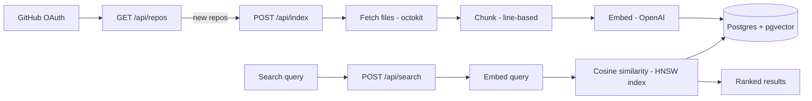

# CodeSearch

Search your GitHub repositories with **natural language** — find code by concept, not by filename or keyword.

Ask *"where do we verify the session token"* and get the auth code back, even if you don't remember the function name. CodeSearch indexes your repos into vector embeddings and runs semantic similarity search over them.

---

## Features

- **Natural-language code search** — describe what code *does*; matches are ranked by semantic similarity, not string matching.
- **GitHub OAuth** — connect with read access and index any repo you own.
- **Automatic indexing** — newly connected repos are chunked, embedded, and stored in the background.
- **Per-repo scoping** — search across all your repos, or narrow to a single one.
- **Live indexing status** — watch repos move through `pending → running → complete` in real time.
- **Multi-language** — TypeScript, JavaScript (`.ts`, `.tsx`, `.js`, `.jsx`) and Python (`.py`).

---

## How it works



**Indexing pipeline** (`POST /api/index`):
1. `fetchRepoFiles` pulls the repo tree via the GitHub API, keeping only supported extensions and skipping dependency/build directories (`node_modules`, `venv`, `__pycache__`, `dist`, …) and files over 300 KB.
2. `chunkFile` splits each file into overlapping line windows (40 lines, 10-line overlap). Empty / whitespace-only chunks are dropped.
3. `embedBatch` sends chunks to OpenAI's `text-embedding-3-small` (1536-dim) in batches of 100.
4. Chunks + embeddings are written to Postgres in batches of 500; the repo is marked `complete`.

**Search** (`POST /api/search`):
1. Scope to repos the authenticated user owns (optionally a single `repoId`).
2. Embed the query.
3. Rank chunks by cosine distance using a pgvector **HNSW** index; return the top matches with a similarity score.

---

## Tech stack

| Layer | Choice |
| --- | --- |
| Framework | Next.js (App Router) + React 19 |
| Styling | Tailwind CSS v4 |
| Auth | better-auth (GitHub OAuth) |
| Database | Postgres (Neon) + [pgvector](https://github.com/pgvector/pgvector) |
| ORM | Drizzle |
| Embeddings | OpenAI `text-embedding-3-small` |
| GitHub API | octokit |
| Data fetching | TanStack Query |

---

## Getting started

### Prerequisites

- Node.js 20+
- A Postgres database with the **`vector` extension** available (Neon works out of the box)
- A GitHub OAuth App
- An OpenAI API key with available quota

### 1. Install

```bash
npm install
```

### 2. Configure environment

Create `.env.local`:

```bash
# Postgres connection string (Neon or any pgvector-enabled Postgres)
DATABASE_URL=postgres://...

# GitHub OAuth App credentials
GITHUB_CLIENT_ID=...
GITHUB_CLIENT_SECRET=...

# better-auth
BETTER_AUTH_URL=http://localhost:3000
BETTER_AUTH_SECRET=...        # generate with: openssl rand -base64 32

# OpenAI
OPENAI_API_KEY=sk-...

# Base URL used to trigger background indexing (server → server fetch)
NEXT_PUBLIC_APP_URL=http://localhost:3000
```

> The GitHub OAuth App's callback URL should be `http://localhost:3000/api/auth/callback/github` in development. The app requests the `read:user`, `user:email`, and `repo` scopes.

### 3. Set up the database

Enable pgvector (once per database):

```sql
CREATE EXTENSION IF NOT EXISTS vector;
```

Push the Drizzle schema:

```bash
npx drizzle-kit push
```

### 4. Run

```bash
npm run dev
```

Open http://localhost:3000, connect GitHub, and head to `/repos` to index and search.

---

## Scripts

| Command | Description |
| --- | --- |
| `npm run dev` | Start the dev server |
| `npm run build` | Production build |
| `npm run start` | Serve the production build |
| `npm run lint` | Run ESLint |
| `npx drizzle-kit push` | Sync the schema to the database |

---

## API routes

| Route | Method | Purpose |
| --- | --- | --- |
| `/api/auth/[...all]` | GET/POST | better-auth handler (OAuth, session) |
| `/api/repos` | GET | List GitHub repos, upsert them, trigger indexing for new ones |
| `/api/repos/status` | GET | Poll indexing status + chunk counts |
| `/api/index` | POST | Index (or reindex) a repo |
| `/api/search` | POST | Semantic search — `{ query, repoId?, limit? }` |

---

## Project structure

```
src/
├── app/
│   ├── page.tsx            # landing page
│   ├── repos/page.tsx      # authenticated dashboard: search + repo grid
│   └── api/                # route handlers (auth, repos, index, search)
├── db/
│   ├── schema.ts           # users/sessions + repos & chunks (vector column)
│   └── index.ts            # Drizzle + Neon client
├── lib/
│   ├── auth.ts             # better-auth config
│   ├── github.ts           # repo file fetching + extension/dir filtering
│   ├── chunker.ts          # line-based chunking
│   └── embed.ts            # OpenAI embedding helpers
└── components/             # UI (button, sign-in, providers)
```

---

## Notes & limitations

- **Chunking is line-based** (fixed windows), not syntax-aware — simple and language-agnostic, but chunks can split across logical boundaries.
- **Embeddings use a single shared OpenAI key**, so all indexing draws from one account/quota.
- **Indexing is triggered from a GET handler** (`/api/repos`) for newly-seen repos; already-indexed repos are only re-indexed via the manual reindex button.
- Failed repos store an error message in the database, but it isn't currently surfaced in the UI.

## Roadmap ideas

- A **evaluation harness** to compare embedding models and chunking strategies.
- Surface indexing errors in the UI; bulk reindex.
-Improving on search queries in general to have it more in general. Reduces noise.

---

Built by [Vinny Pham](https://github.com/vnnphm) & [Quang Vu](https://github.com/qvu50015).
